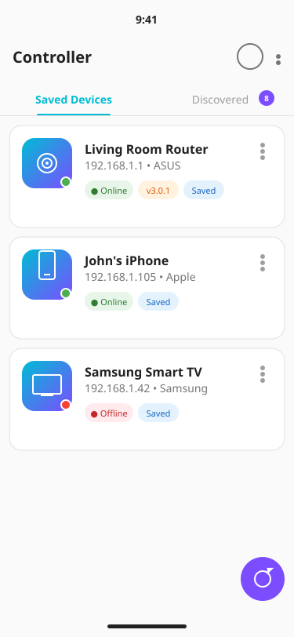
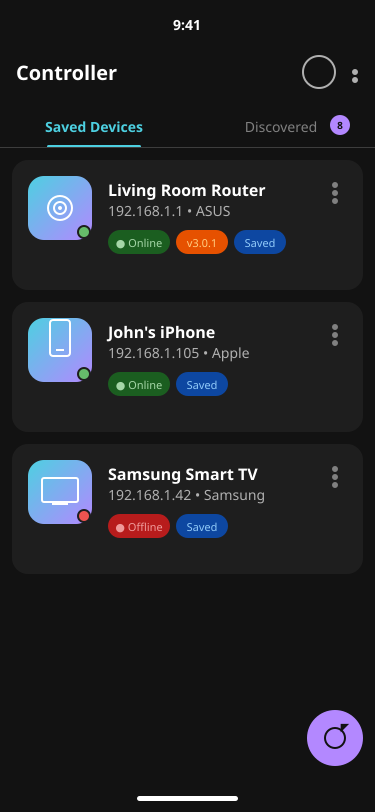

# Controller App

A beautiful, modern Android application for network device discovery and control. Built with Java and traditional XML layouts, featuring Material Design 3 with vibrant colors, dark mode support, and RTL compatibility.

<p align="center">
  
  
</p>

## Features

### 🔍 Multi-Protocol Device Discovery

The app discovers devices on your network using multiple protocols simultaneously:

| Protocol | Description |
|----------|-------------|
| **ARP** | Reads the ARP table to find active devices |
| **mDNS/Bonjour** | Multicast DNS for Apple/Zeroconf devices |
| **NSD (DNS-SD)** | Android Network Service Discovery |
| **UDP Broadcast** | Custom discovery protocol (port 9999) |
| **SSDP/UPnP** | Simple Service Discovery Protocol |
| **MNDP** | MikroTik Neighbor Discovery Protocol |
| **NetBIOS** | Windows/Samba device discovery |

### 🎨 Beautiful UI

- **Material Design 3** with vibrant teal and purple accent colors
- **Dark Mode** support with automatic system theme detection
- **RTL Support** for right-to-left languages
- **Card-based layout** with smooth animations
- **Status indicators** (online/offline) with elegant chips
- **Context menus** for quick device actions

### 📱 Device Management

- **Save devices** for quick access later
- **View detailed information**: IP, MAC, hostname, manufacturer, firmware
- **Quick actions**: Connect, copy IP/MAC, delete
- **Auto-refresh** on pull-down
- **Search** across all device properties

## Screenshots

The app features a modern, elegant design:

- **Saved Devices Tab**: Your saved devices with online/offline status
- **Discovered Tab**: Real-time discovered devices on the network
- **Device Cards**: Shows name, IP, manufacturer, status chips, firmware version
- **Context Menu**: Quick actions via the ••• button
- **Detail Dialog**: Full device information in a beautiful dialog

## Installation

### From Release

1. Download the latest APK from [Releases](../../releases)
2. Enable "Install from unknown sources" if prompted
3. Install and open the app

### Build from Source

```bash
# Clone the repository
git clone https://github.com/atomicdeploy/controller-app.git
cd controller-app

# Build debug APK
./gradlew assembleDebug

# Build release APK
./gradlew assembleRelease

# Install on connected device
./gradlew installDebug
```

## Requirements

- **Minimum SDK**: Android 7.0 (API 24)
- **Target SDK**: Android 14 (API 34)
- **Permissions**: 
  - `INTERNET` - Network access
  - `ACCESS_NETWORK_STATE` - Network state detection
  - `ACCESS_WIFI_STATE` - WiFi information
  - `CHANGE_WIFI_MULTICAST_STATE` - For mDNS discovery
  - `NEARBY_WIFI_DEVICES` (Android 13+) - Device discovery

## Device Implementation Guide

For your devices to be discovered by this app, implement one or more of the following protocols:

### NSD (DNS-SD) Response

Register a service with these TXT records:
```
Service Type: _controller._tcp
TXT Records:
  - deviceName=<human-readable name>
  - deviceType=<type: controller, sensor, switch>
  - firmwareVersion=<version>
  - manufacturer=<company>
  - macAddress=<AA:BB:CC:DD:EE:FF>
```

### UDP Broadcast Response

Listen on port 9999 for discovery requests and respond with:
```json
{
  "macAddress": "AA:BB:CC:DD:EE:FF",
  "ipAddress": "192.168.1.100",
  "deviceName": "My Device",
  "deviceType": "controller",
  "manufacturer": "AtomicDeploy",
  "firmwareVersion": "1.2.3"
}
```

See [NetworkDiscoveryManager.java](app/src/main/java/com/atomicdeploy/controller/network/NetworkDiscoveryManager.java) for full protocol specifications.

## Project Structure

```
app/
├── src/main/
│   ├── java/com/atomicdeploy/controller/
│   │   ├── ControllerApplication.java
│   │   ├── network/
│   │   │   └── NetworkDiscoveryManager.java
│   │   ├── ui/
│   │   │   ├── MainActivity.java
│   │   │   └── DeviceAdapter.java
│   │   └── utils/
│   │       └── DeviceStorage.java
│   └── res/
│       ├── layout/          # XML layouts
│       ├── values/          # Light theme resources
│       ├── values-night/    # Dark theme resources
│       ├── drawable/        # Icons and shapes
│       └── menu/            # Menu definitions
├── build.gradle             # App build config
└── proguard-rules.pro       # ProGuard rules (disabled by default)
```

## CI/CD

The project uses GitHub Actions for continuous integration:

- **Build**: Compiles debug and release APKs
- **Lint**: Runs Android lint checks
- **Release**: Creates GitHub releases on version tags

Trigger a release by pushing a version tag:
```bash
git tag v1.0.0
git push origin v1.0.0
```

## Contributing

Contributions are welcome! Please read the [Copilot Onboarding Guide](docs/COPILOT_ONBOARDING.md) for development tips.

1. Fork the repository
2. Create a feature branch (`git checkout -b feature/amazing-feature`)
3. Commit your changes (`git commit -m 'Add amazing feature'`)
4. Push to the branch (`git push origin feature/amazing-feature`)
5. Open a Pull Request

## License

This project is open source and available under the MIT License.

## Acknowledgments

- [Material Design 3](https://m3.material.io/) for design guidelines
- [Android Jetpack](https://developer.android.com/jetpack) for libraries
- [jmDNS](https://github.com/jmdns/jmdns) for mDNS support
